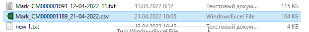
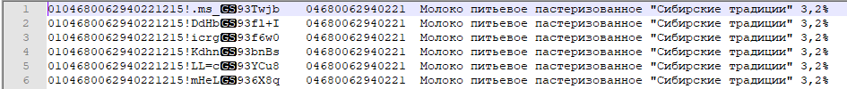
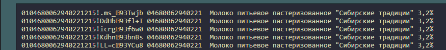
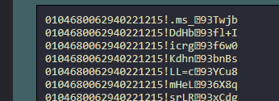
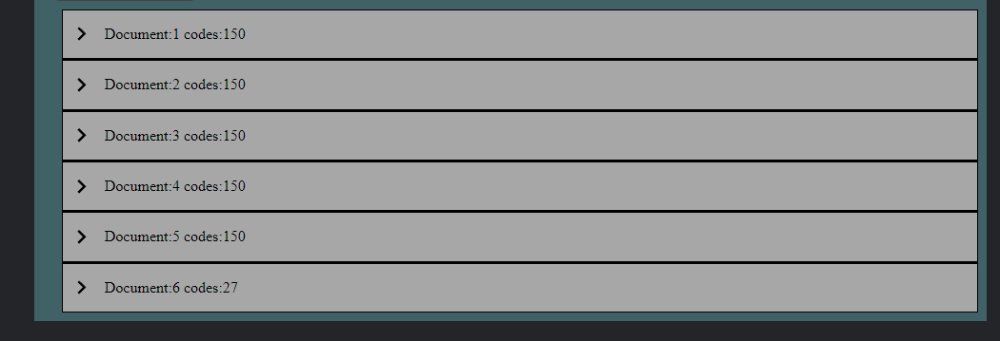
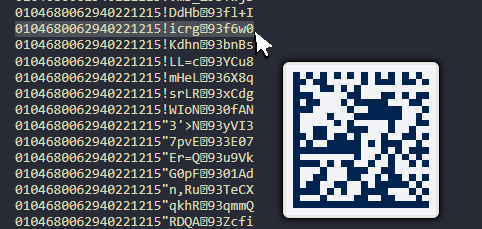

  <b>QR-TXT-EDITOR</b>

  

  

Приложение для преобразования большого списка QR кодов, в отдельные фаилы формата .txt

Поддерживает входные фаилы форматов .csv и .txt

### Инструкция по применению:

-   Открыть страницу приложения
-   Нажать на кнопку "выбрать фаил" и выбрать фаил со списком qr кодов
    

    Предпологается что содержимое фаила будет такого вида...
    

    Это крайне важно, т.к. алгоритм удаления ненужного описания настроен именно на такой шаблон данных. При несовпадении шаблона будет выдана ошибка.
    После выбора фаила, оно откроется в приложении.
    

-   Нажать на кнопку "удалить лишнее", после этого отображаемое содержимое должно выглядеть так...
    

    Это непосредственно сам qr код. Удаленное описание никак не скажется на закодированной информации в qr коде.

-   Далее можно разбить этот фаил на множество небольших фаилов. Для этого нужно заполнить форму рядом с кнопкой "удалить лишнее", это необходимое количество кодов в одном фаиле, по умолчанию оно имеет значение "150", если изменение не требуется можно сразу нажать на кнопку "удалить лишнее".
    После этого станет доступен предварительный просмотр каждого сгенерированого фаила.
    

    **Для компьютеров** доступен предворительный просмотр каждого qr кода в формате DataMatrix

    

-   Теперь можно скачать все сгенерированые фаилы в одном архиве, нажав соответствующую кнопку.

#### Ссылки:

1. **[Ссылка](https://bigmack2304.github.io/qr-txt-decompiller/dist/final/index.html) на релизную версию приложения.**

2. [Ссылка](https://bigmack2304.github.io/qr-txt-decompiller/dist/dev/index.html) на последнюю тестовую версию приложения.

3. [Ссылка](https://disk.yandex.ru/d/rNEfis2mVBj2jw) фаил с qr кодами показанный в примере.

#### Используемые технологии:

-   HTML5
-   CSS3
-   LESS
-   PostCSS
-   Java Script
-   Type Script
-   WebPack

#### Используемые библиотеки:

-   [jszip](https://github.com/Stuk/jszip) (генерация и сохранение .zip архива)
-   [papaparse](https://github.com/mholt/PapaParse) (обработка .csv таблиц)
-   [datamatrix.js](https://github.com/datalog/datamatrix-svg) (рендер QR кода формата "data matrix")
